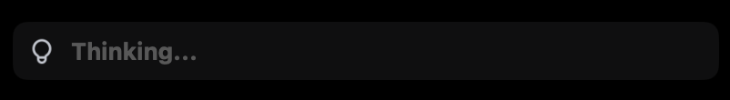
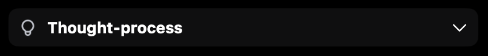
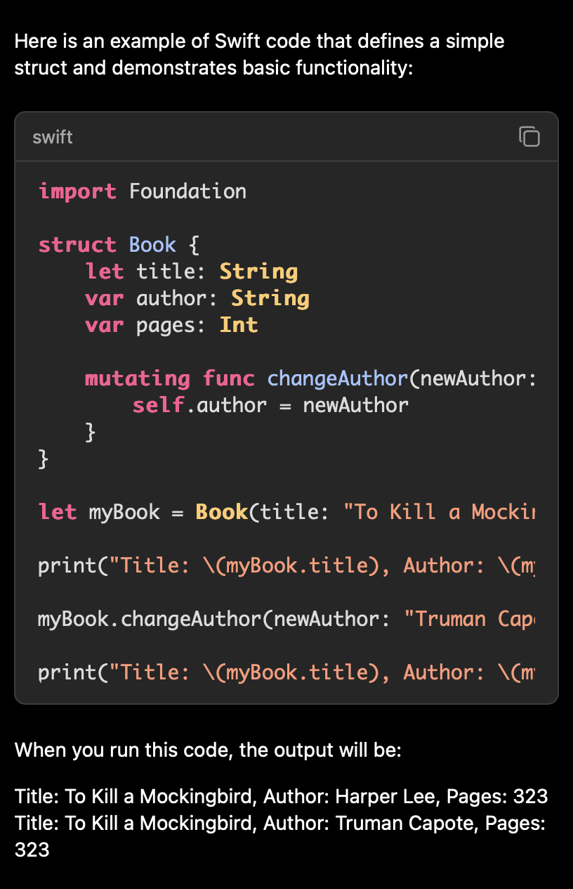
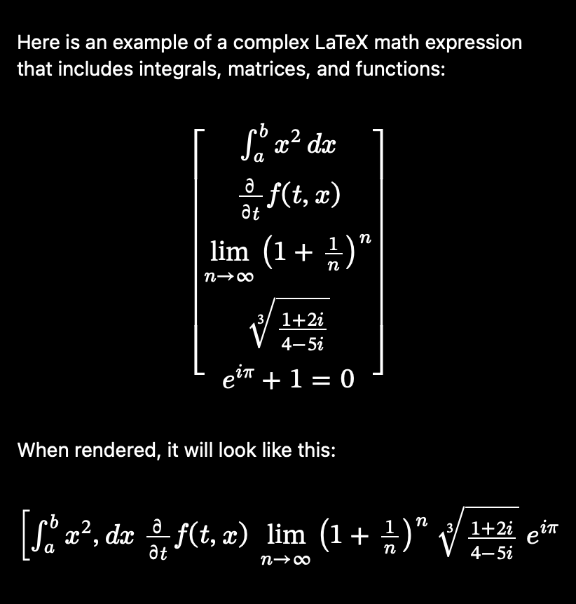

# LLMStream

LLMStream is a powerful iOS/macOS Swift Package that provides a customizable WebView component for rendering rich text content with advanced features:

## ✨ Key Features

- 🤔 **Thinking State** - Elegant loading state when response contains `<think>` tag

<p align="center">
  
  
</p>

- 📝 **Markdown Support** - Complete Markdown rendering with inline formatting and nested lists
- 💻 **Code Highlighting** - Syntax highlighting for multiple programming languages with convenient copy functionality

<p align="center"></p>

- ⚡ **LaTeX Integration** - Seamless rendering of mathematical expressions:
  - Inline expressions using `$...$`
  - Display math using `\[...\]`
  - Partial document rendering

<p align="center"></p>

- 🔄 **Real-time Updates** - Smooth content updates without flickering
- 🎨 **Customizable Styling** - Flexible appearance configuration

## 🛠 Technology Stack

- **Markdown Processing**: `markdown-it` for robust Markdown parsing
- **Code Highlighting**: `highlight.js` for syntax highlighting
- **Math Rendering**: `Mathjax` for LaTeX processing
- **Platform**: Optimized for macOS

## 📋 Requirements

- iOS 16.0 or later
- macOS 13.0 or later
- Swift 5.7+
- Xcode 14+

## 📦 Installation

### Swift Package Manager

1. Add the following dependency to your `Package.swift`:

```swift
dependencies: [
    .package(url: "https://github.com/synth-inc/LLMStream", branch: "main")
]
```

2. Add required entitlements to your project:

```xml
<key>com.apple.security.network.client</key>
<true/>
<key>com.apple.security.web</key>
<true/>
```

## 💻 Usage

1. Import the package in your Swift file:

```swift
import LLMStream
```

2. Implement the view in your SwiftUI code:

```swift
struct ContentView: View {
    @State var height: CGFloat = 0

    var body: some View {
        LLMStreamView(
            text: "# Hello **Markdown** & $\\LaTeX$"
        )
    }
}
```

## ⚙️ Configuration

LLMStream offers extensive customization options through `LLMStreamConfiguration`. You can customize every aspect of the rendering:

### Font Configuration
```swift
let fontConfig = FontConfiguration(
    size: 14.0,                    // Base font size
    lineHeight: 1.4,               // Line height multiplier
    family: "-apple-system...",    // Main font family
    codeFontFamily: "SF Mono...",  // Code blocks font
    tableFontFamily: "system-ui...",// Table font
    mathFontFamily: "STIX Two Math..." // Math expressions font
)
```

### Color Configuration
```swift
let colorConfig = ColorConfiguration(
    textColor: .white,
    backgroundColor: .clear,
    codeBackgroundColor: Color(red: 0.15, green: 0.15, blue: 0.15),
    codeBorderColor: Color(white: 0.24),
    linkColor: Color(red: 0.29, green: 0.60, blue: 1.0),
    thoughtBackgroundColor: Color.gray.opacity(0.1),
    tableHeaderBackgroundColor: Color(white: 0.24),
    tableBorderColor: Color(white: 0.4),
    tableRowEvenColor: Color(white: 0.2).opacity(0.2),
    tableRowHoverColor: Color(white: 0.27).opacity(0.3),
    theoremBorderColor: Color(red: 0.29, green: 0.60, blue: 1.0),
    proofBorderColor: Color(white: 0.47)
)
```

### Layout Configuration
```swift
let layoutConfig = LayoutConfiguration(
    contentPadding: EdgeInsets(top: 0, leading: 0, bottom: 0, trailing: 0),
    codePadding: EdgeInsets(top: 12, leading: 16, bottom: 12, trailing: 16),
    thoughtPadding: EdgeInsets(top: 8, leading: 8, bottom: 8, trailing: 8),
    tablePadding: EdgeInsets(top: 8, leading: 8, bottom: 8, trailing: 8),
    spacing: 8,
    cornerRadius: 8,
    tableCornerRadius: 5,
    theoremCornerRadius: 4
)
```

### Code Block Configuration
```swift
let codeConfig = CodeBlockConfiguration(
    showLanguage: true,           // Show language label
    showCopyButton: true,         // Show copy button
    showActionButton: true,       // Show action button
    languageTextSize: 13.0,       // Language label size
    copyButtonSize: 16,           // Copy button size
    actionButtonSize: 16,         // Action button size
    copyButtonOpacity: 0.5,       // Copy button normal opacity
    copyButtonHoverOpacity: 1.0,  // Copy button hover opacity
    actionButtonOpacity: 0.5,     // Action button normal opacity
    actionButtonHoverOpacity: 1.0,// Action button hover opacity
    actionButtonIcon: "play.circle", // SF Symbol name for action button
    actionButtonTooltip: "Execute"   // Action button tooltip
)
```

### Using Code Action Callback

You can add a custom action button to code blocks that triggers a callback with the code content:

```swift
LLMStreamView(
    text: "Your content here",
    configuration: LLMStreamConfiguration(
        codeBlock: CodeBlockConfiguration(
            showActionButton: true,
            actionButtonIcon: "play.circle",
            actionButtonTooltip: "Run this code"
        )
    ),
    onCodeAction: { code in
        // Handle the code execution here
        print("Code to execute:", code)
    }
)
```

### Table Configuration
```swift
let tableConfig = TableConfiguration(
    showCaption: true,
    captionStyle: TableConfiguration.CaptionStyle(
        fontSize: 0.9,
        textColor: Color(white: 0.8)
    ),
    headerStyle: TableConfiguration.HeaderStyle(
        fontWeight: .bold,
        textAlignment: .center,
        borderWidth: 2.0
    ),
    enableHover: true,
    enableZebraStripes: true
)
```

### Thought Process Configuration
```swift
let thoughtConfig = ThoughtConfiguration(
    icon: Image(systemName: "brain"),  // Optional icon
    iconSize: 16,
    thinkingTitle: "Thinking...",      // Loading state title
    thoughtTitle: "Thought-process",    // Normal state title
    showExpandButton: true
)
```

### Animation Configuration
```swift
let animationConfig = AnimationConfiguration(
    thoughtExpandAnimation: .spring(response: 0.35, dampingFraction: 0.85),
    shimmerAnimation: .linear(duration: 1.5).delay(0.25).repeatForever(autoreverses: false),
    shimmerGradient: Gradient(colors: [
        .black.opacity(0.3),
        .black,
        .black.opacity(0.3)
    ])
)
```

### Using Custom Configuration

```swift
let config = LLMStreamConfiguration(
    font: fontConfig,
    colors: colorConfig,
    layout: layoutConfig,
    thought: thoughtConfig,
    animation: animationConfig,
    codeBlock: codeConfig,
    table: tableConfig
)

LLMStreamView(
    text: "Your content here",
    configuration: config
)
```

## 🎯 Examples

### Markdown with LaTeX

```markdown
# Integration Example

This is a **bold** text with an inline equation: $E = mc^2$

## Display Math

\[
\int_{-\infty}^{\infty} e^{-x^2} dx = \sqrt{\pi}
\]
```

## 🤝 Contributing

Contributions are welcome! Feel free to submit issues and pull requests.

## 📄 License

This project is licensed under the MIT License - see the LICENSE file for details.

## 🙏 Acknowledgments

- [markdown-it](https://github.com/markdown-it/markdown-it) for Markdown parsing
- [highlight.js](https://highlightjs.org/) for code syntax highlighting
- [MathJax](https://www.mathjax.org/) for LaTeX rendering
